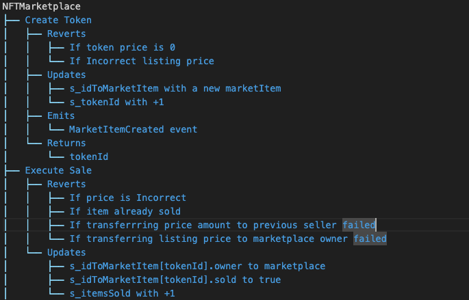
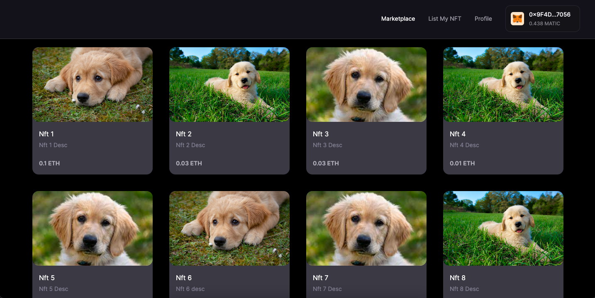
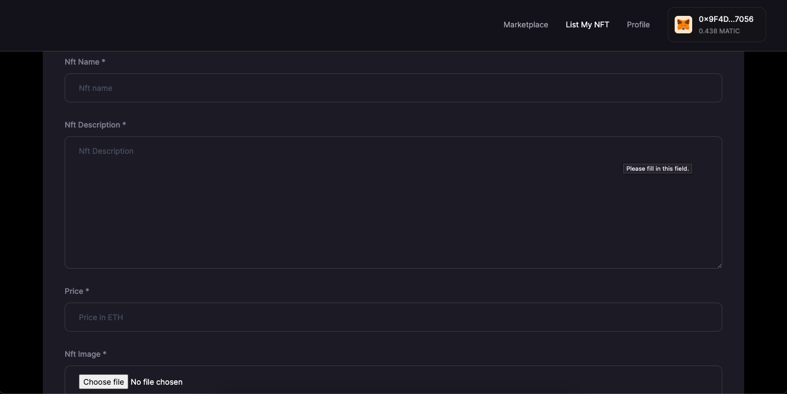
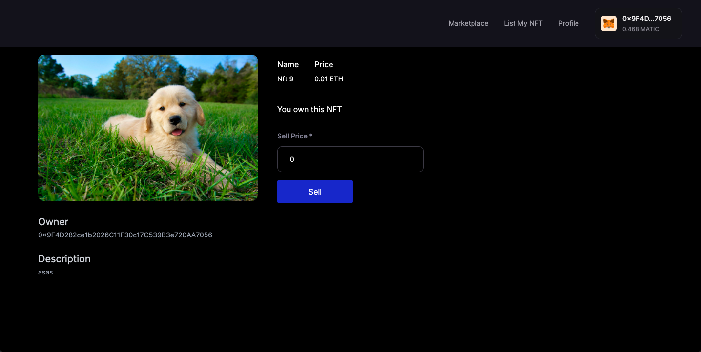

# NFT Marketplace

## About

Ethereum-based NFT marketplace where users can securely sell their digital assets, while others can purchase them without intermediaries. The platform operates autonomously, leveraging blockchain technology for transparent transactions and ensuring decentralized control over the entire process.

## Workflow



-   [Checkout the complete workflow](./test/NftMarketplace.tree)

## Test

```sh
forge test
```

| File                              | % Lines         | % Statements    | % Branches      | % Funcs         |
| --------------------------------- | --------------- | --------------- | --------------- | --------------- |
| script/DeployNftMarketplace.s.sol | 100.00% (4/4)   | 100.00% (5/5)   | 100.00% (0/0)   | 100.00% (1/1)   |
| src/NFTMarketplace.sol            | 100.00% (54/54) | 100.00% (59/59) | 100.00% (22/22) | 100.00% (10/10) |
| Total                             | 100.00% (59/59) | 100.00% (65/65) | 100.00% (22/22) | 100.00% (12/12) |

or

```sh
forge test --rpc-url <RPC_URL>
```

## Deployment

-   To deploy to Anvil
-   Start the anvil chain

```
make deployToAnvil
```

or

## Deployment to a testnet or mainnet

1. Setup environment variables

-   You'll want to set your `SEPOLIA_RPC_URL` in environment variables. You can add them to a `.env` file, similar to what you see in `.env.example`.

2. Use wallet options to Encrypt Private Keys

-   [Private Key Encryption](https://github.com/allwin199/foundry-fundamendals/blob/main/DeploymentDetails.md)

Optionally, add your `ETHERSCAN_API_KEY` if you want to verify your contract on [Etherscan](https://etherscan.io/).

### Get testnet ETH

Head over to [faucets.chain.link](https://faucets.chain.link/) and get some testnet ETH. You should see the ETH show up in your metamask.

### Deploy

```sh
make deployToSepolia
```

---

## Demo

[NFT Marketplace Nextjs App](https://nft-marketplace-frontendv1.vercel.app/)  
[Github](https://github.com/allwin199/nft-marketplace-frontend)

### Marketplace



---

### List NFT



---

### Buy NFT


---

### Sell NFT



## Thank You :)
