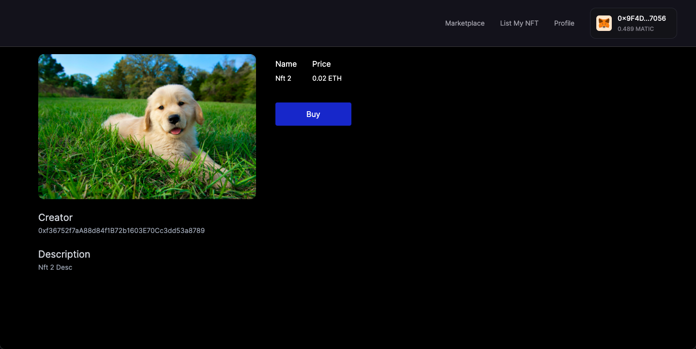

# NFT Marketplace

## About

Ethereum-based NFT marketplace where users can securely sell their digital assets, while others can purchase them without intermediaries. The platform operates autonomously, leveraging blockchain technology for transparent transactions and ensuring decentralized control over the entire process.

## Demo

[NFT Marketplace Nextjs App](https://nft-marketplace-frontendv1.vercel.app/)  
[Github](https://github.com/allwin199/nft-marketplace-frontend)

### Marketplace

---

### List NFT

---

### Buy NFT

---

### Sell NFT

## Thank You :)
